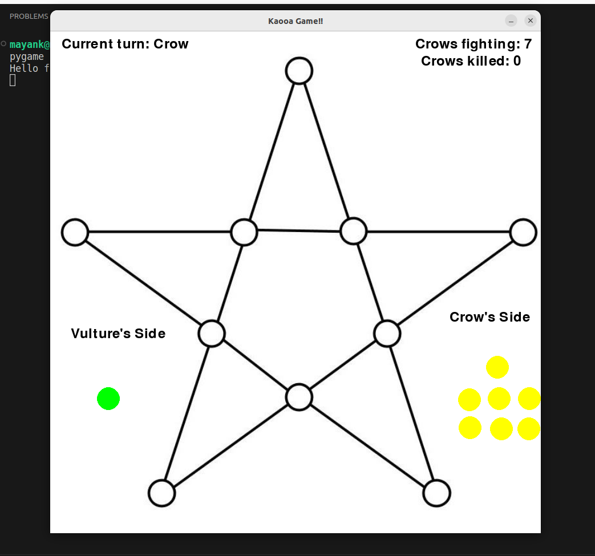
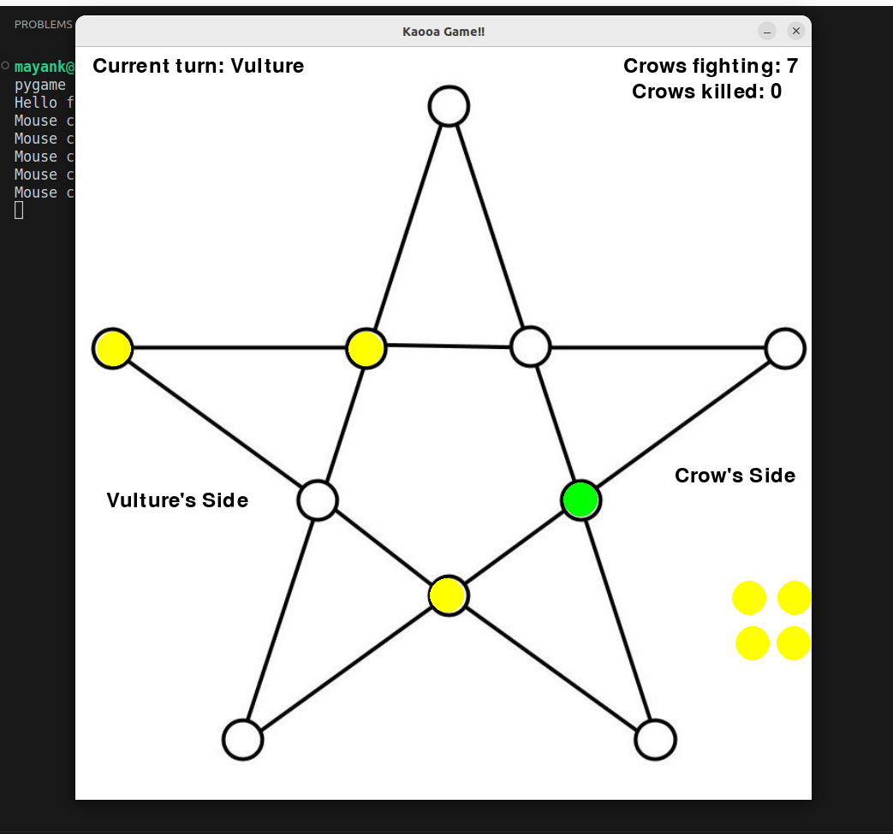

Input :  In my game firstly user will see 7 yellow(crow) coins in right and one green(vulture) coin on left. Firstly there will be crow's turn so user have to drag the coin to the any circle on the star. If user is failed to do then alert of 1 seconds are displayed like "You have to put in circle" etc and also the coin goes to its initial position until rightly placed and same with green coin also. In whole game you have to drag the coins.
Also met the two main conditions:
1) Yellow coin can move to its adjacent location only when all are put once on the star board else if you try to do alert will be shown.
2) If green coin(vulture) is having a chance to kill yellow coin(crow) then it has to do otherwise alerts will be displayed and my game will not move further unless it kills the crow in which final position is empty and the move is in straight line
Output: If all crows are successful to block the vulture i.e the green coin then message of crows winning will be displayed on screen for some time and also print on terminal.
And if vulture is able to kill at least 4 crows then saame above happens for vulture and game ends.

    

